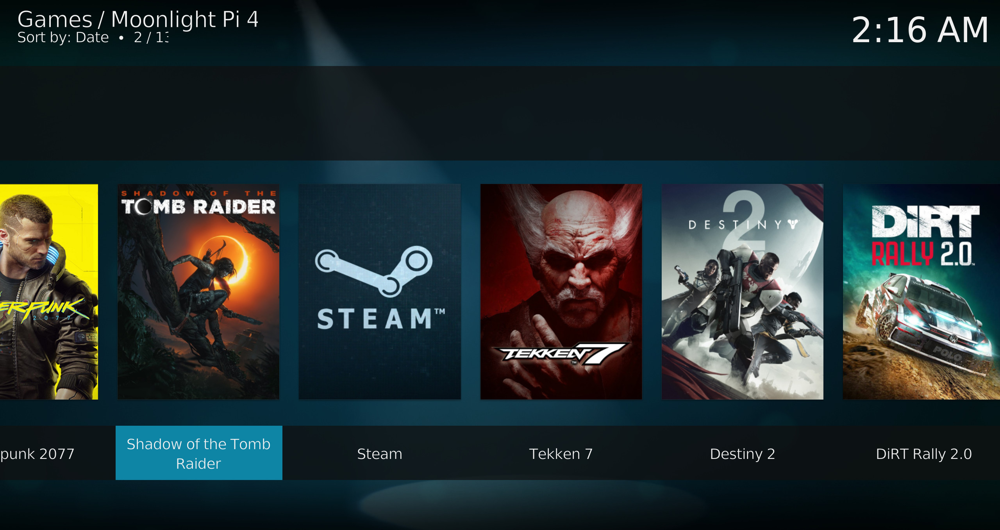
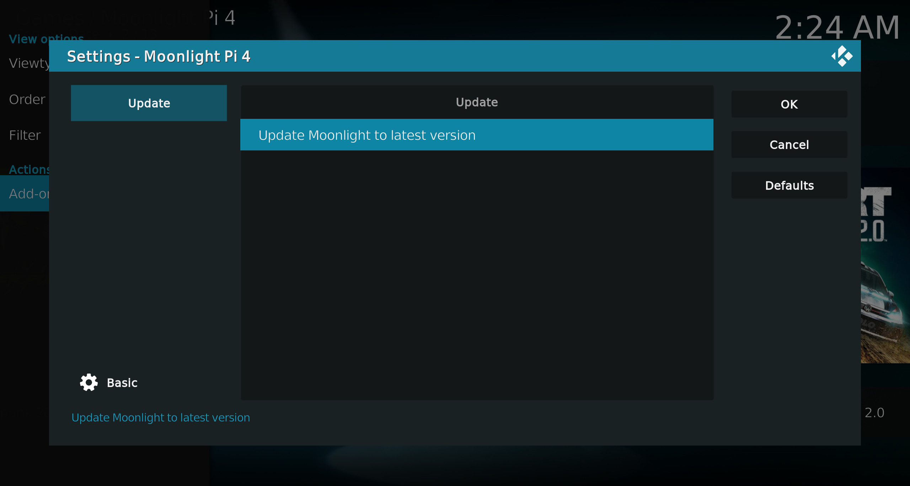
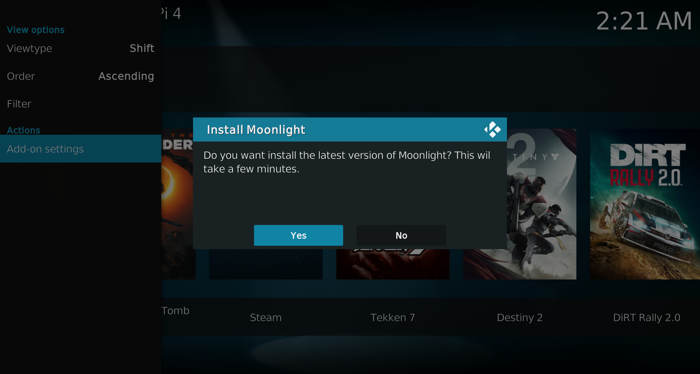

# Kodi 19+ Moonlight launcher for the Raspberry Pi 4 and Generic x86_64 systems
A launcher and updater for running Moonlight on Raspberry Pi 4 systems with LibreELEC/Raspberry Pi OS and Generic x86_64 systems running LibreELEC or Ubuntu.

## Background:
This Kodi addon-on was developed to enable Moonlight game streaming on LibreELEC systems.
Since LibreELEC is a "just enough" distribution dependencies for Moonlight are missing, requiring some extra steps to get things running. 
A simple add-on lets you install and launch Moonlight from within Kodi and stream games from your PC to your LibreELEC device.

More info on Moonlight for the Raspberry Pi 4 specific can be found here:
https://github.com/moonlight-stream/moonlight-docs/wiki/Installing-Moonlight-Qt-on-Raspberry-Pi-4

And for more general info about Moonlight:
https://github.com/moonlight-stream/moonlight-qt

At the time of writing the only platform that support's Moonlight on a Raspberry Pi 4 without a running X-server seems to be Moonlight-qt. 

## Prerequisites:
- [Raspberry Pi 4](https://libreelec.tv/raspberry-pi-4/), a [Generic x86_64 device](https://libreelec.tv/downloads_new/generic-pc/) with LibreELEC (Matrix) 10+, Ubuntu (x86_64) or Raspberry Pi OS installed
- On Raspberry Pi 5, use LibreELEC (Nexus) 11+
- Device is connected to a local network via ethernet (preferred) or Wi-Fi
- On LibreELEC 11 Generic the "Legacy Generic PC" version is preferred, see known issues. 
- Other Linux distributions may also work but are not tested. 
- Gaming PC with Steam and Nvidia GeForce Experience installed, connected to local network via ethernet (preferred) or Wi-Fi
- Enough temporary storage space on your LibreELEC device to install Moonlight (about 500 MB is needed)

### Raspberry Pi 3
Raspberry Pi 3 works (limited support up to 720p) but needs changes to LibreELEC's config:
- Login into your Pi 3 using SSH
- Make config writable: `mount -o remount,rw /flash/`
- In /flash/distroconfig.txt replace `dtoverlay=vc4-kms-v3d` with `dtoverlay=vc4-fkms-v3d` to enable fake KMS mode instead of full KMS
- In /flash/config.txt add `dtparam=audio=on` to enable audio in fake KMS mode
- Make config read only again: `mount -o remount,ro /flash/`
- Reboot the Pi 3

## Instructions:
### 1. Install this plugin.
- Download [plugin.program.moonlight-qt.zip](https://github.com/veldenb/plugin.program.moonlight-qt/releases/latest/) and store it on your Kodi device.
- In Kodi install Docker from the LibreELEC repository: Add-ons / Install from repository / LibreELEC Add-ons / Services / Docker _**(skip this on Ubuntu and Raspberry Pi OS)**_
- Reboot LibreELEC to ensure Docker works _**(skip this on Ubuntu and Raspberry Pi OS)**_
- Go to Add-ons / Install from zip file
- Select plugin.program.moonlight-qt.zip

   
### 2. Start Moonlight 
- Navigate to Games -> Moonlight
- Start Moonlight from the Games menu
- The plugin will ask you to install Moonlight, choose yes and wait a few minutes
- When the plugin has finished installing, Moonlight wil launch it
- Moonlight should start and scan for PC's with Gamestream enabled
- Make sure you have a gamepad or keyboard/mouse connected to control Moonlight-qt, remote controls don't work in Moonlight-qt

### 3. Enable Nvidia Gamestream on your gaming PC

GeForce Experience/Settings/Shield/Gamestream (move slider to right)

If your PC is not recognised you can try to turn it off and on again on your gaming PC. You can also add your PC using the IP-address by pressing the + icon in the upper right corner.

### 4. Pair your gaming PC
Once your PC is recognised by Moonlight, you will be asked to enter a 4-digit code into Gamestream to pair Moonlight with Gamestream.
When the pairing is finished you can use Moonlight to adjust settings for streaming and launch games. Exit Moonlight and you will be returned to Kodi.

### 5. Launch games from Kodi
Because Moonlight saves its configuration and image-cache to Kodi's storage you can now browse and start your games using the Games menu in Kodi by entering the "Moonlight" menu item. 
Remember that all games are displayed from local cache, so they are only updated when Moonlight connects to your gaming PC.

### 5. Updating
When you want to update Moonlight you can use the update menu in the add-on settings and press "Update Moonlight to the latest version".
The plugin will update Moonlight and will notify you when it's finished.

## What magic is happening in the background when installing and updating?
### Raspberry 4 on LibreELEC
Essentially the plugin uses Docker to download Debian Buster and install Moonlight by automating the command's given on this page: \
https://github.com/moonlight-stream/moonlight-docs/wiki/Installing-Moonlight-Qt-on-Raspberry-Pi-4 \
When that installation procedure has finished the plugin copies the needed executables and libraries from the Docker container and then destroys the container.
The plugin can use the copied files to launch Moonlight from Kodi without the extra overhead from Docker. 

### Raspberry 4 on Raspberry Pi OS
This support is still experimental. The plugin installs Moonlight-qt with APT directly onto the system, Docker is not used in this setup. 

### Generic x86_64
Somewhat the same as the Pi 4 build but based on an AppImage Moonlight build. Extra libraries are injected into the AppImage.

## Known problems
### Hardware acceleration on LibreELEC 11 Generic x86_64 doesn't work
LibreELEC supplies two builds for Generic x86_64:
- One using GBM: _"Generic PC (no NVIDIA support)"_ 
- And a Legacy-build using X11: _"Legacy Generic PC (for older PCs and NVIDIA GPUs)"_.
 
The drivers on the GBM build are still very new and not stable on all hardware. The Legacy-build should be stable on most hardware and is preferred at the moment.  

### Sound in Kodi but no sound in Moonlight-qt
Try to select a non-default audio device in Kodi's audio configuration. Kodi's and moonlight-qt's default audio device may differ and if a specific audio device is selected in Kodi the plugin instructs Moonlight-qt to use the device chosen in Kodi.

### Surround 5.1/7.1 channels use the wrong speakers
Try to change the ALSA channel mapping in the plugin settings menu.

### Using HDR my display turns black
This is a known issue in moonlight-qt, HDR support is still experimental and may be unstable.

### It doesn't work on my Raspberry Pi 5
For the Raspberry Pi 5, use at least the latest LibreELEC stable release and the latest version on this add-on.

### It doesn't work on my Amlogic device
Amlogic devices don't always work, forcing the EGL card to card0 or card1 in the settings menu might get your device working.
Some devices are known to not work at all, see this page for details: https://github.com/moonlight-stream/moonlight-docs/wiki/Installing-Moonlight-Qt-on-ARM%E2%80%90based-Single-Board-Computers 

### Help, it still doesn't work
You can always open an issue if Moonlight doesn't launch/update or the game menu doesn't work.
All configuration and streaming problems are probably related to Moonlight self, you can report that on their own GitHub page: https://github.com/moonlight-stream/moonlight-qt/issues   

## Thanks
Thanks to [Cameron Gutman](https://github.com/cgutman) for all the work on Moonlighti-qt.\
Thanks to [clarkemw and peetie2k](https://github.com/clarkemw/moonlight-embedded-launcher) for inspiration.\
Thanks to [Janne Hakonen](https://github.com/jhakonen) for the Generic x86_64 work, great job! 
